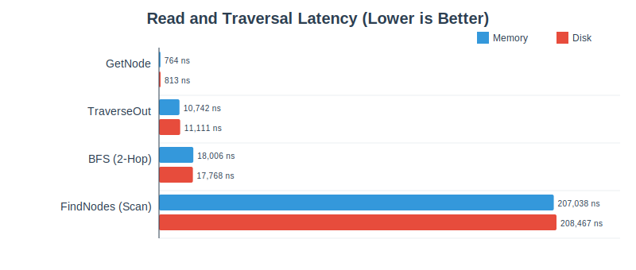
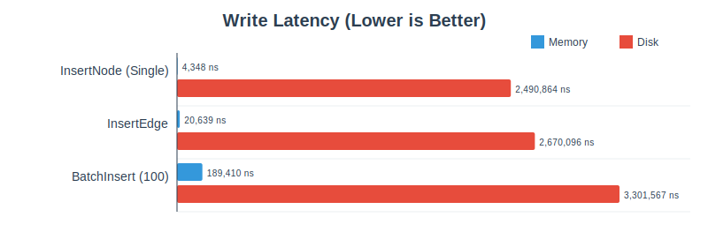

# Pathway

Pathway is an experimental Go library for an embedded, persistent graph database
based on the [Pebble](https://github.com/cockroachdb/pebble) key-value database.
It provides a fluid, Gremlin-like query interface for natural graph traversals.

> **NOTE**: This is an experimental library that was not validated for
> production use.

Vibe coded using [Google Antigravity](https://antigravity.google/).

## Installation

```bash
go get github.com/npclaudiu/pathway
```

## Quickstart

Initialize the database, perform transactions, and run queries.

```go
package main

import (
 "context"
 "log"

 "github.com/google/uuid"
 "github.com/npclaudiu/pathway"
)

func main() {
 // Open an in‑memory database for the example.
 db, err := pathway.Open(":memory:")
 if err != nil {
  log.Fatalf("failed to open db: %v", err)
 }
 defer db.Close()

 ctx := context.Background()

 // Create a node.
 nodeID := uuid.New()
 if err := db.Update(ctx, func(tx *pathway.Tx) error {
  if err := tx.PutNode(nodeID, "User"); err != nil {
   return err
  }
  // Set a property.
  return tx.SetProperties(nodeID, map[string]interface{}{"name": "alice"})
 }); err != nil {
  log.Fatalf("failed to create node: %v", err)
 }

 // Query the node back.
 if err := db.View(ctx, func(tx *pathway.Tx) error {
  label, exists, err := tx.GetNode(nodeID)
  if err != nil {
   return err
  }
  if exists {
   log.Printf("node %s has label %s", nodeID, label)
  }
  return nil
 }); err != nil {
  log.Fatalf("read transaction failed: %v", err)
 }
}
```

## Architecture & Performance

### Data Model

* **Nodes**: Atomic entities identified by **16-byte UUIDs**.
* **Edges**: Directed connections with a **Label** and properties.
* **Properties**: Key-Value pairs attached to nodes/edges.
* **Constraints**:
  * **Labels**: Recommended max 255 bytes.
  * **IDs**: UUIDs only.
  * **Properties**: Supports standard JSON types. Encoded with type prefix for
    type safety.

## Performance

The following benchmarks measure the performance of key graph operations using
the standard Go testing framework. Each scenario is executed in two storage
modes:

1. **In-Memory Storage (`:memory:`)**: Measures the overhead of the Pathway
   library logic, graph traversal engine, and encoding layer without disk I/O.
2. **Disk Storage**: Measures real-world performance using a temporary directory
   on the local filesystem. This includes the cost of ACID transactions and
   `fsync` operations provided by the underlying Pebble storage engine.

### Interpretation

* **Ns/Op**: Nanoseconds per operation (lower is better).
* **Bytes/Op**: Average memory allocated per operation.
* **Allocs/Op**: Average number of heap allocations per operation.

> **Disclaimer**: The results below are a sample run on specific hardware.
> Actual performance will vary depending on your machine, operating system,
> filesystem configuration, and data characteristics.

Benchmarks were run on an **Apple M2 Pro** (darwin/arm64).

### In-Memory Storage (`:memory:`)

| Benchmark | Operations | Ns/Op | Bytes/Op | Allocs/Op |
| :--- | :--- | :--- | :--- | :--- |
| **GetNode** | 1,495,675 | 764.5 | 152 | 5 |
| **FindNodes** (Scan) | 5,725 | 207,038 | 389 | 8 |
| **InsertNode** | 303,726 | 4,348 | 1,608 | 11 |
| **BatchInsertNode** (100) | 5,612 | 189,410 | 164,367 | 998 |
| **InsertEdge** | 187,784 | 20,639 | 2,262 | 25 |
| **TraverseOut** (1-hop) | 110,222 | 10,742 | 3,584 | 70 |
| **BFS_2Hop** | 67,443 | 18,006 | 6,645 | 132 |

### Disk Storage (SSD)

| Benchmark | Operations | Ns/Op | Bytes/Op | Allocs/Op |
| :--- | :--- | :--- | :--- | :--- |
| **GetNode** | 1,446,253 | 813.2 | 152 | 5 |
| **FindNodes** (Scan) | 5,700 | 208,467 | 389 | 8 |
| **InsertNode** | 517 | 2,490,864 | 602 | 10 |
| **BatchInsertNode** (100) | 378 | 3,301,567 | 47,189 | 934 |
| **InsertEdge** | 506 | 2,670,096 | 1,184 | 22 |
| **TraverseOut** (1-hop) | 101,926 | 11,111 | 3,593 | 70 |
| **BFS_2Hop** | 63,694 | 17,768 | 6,666 | 133 |

> **Note**: Disk write performance reflects full ACID compliance with `fsync`
> enabled for every transaction. Batch operations significantly amortize this
> cost.

### Visual Comparison





## Concurrency & Thread Safety

* **Graph Handle**: The `*Database` instance is **safe** for concurrent use.
* **Transactions**: Individual `Tx` (Read-Write) and `ReadTx` (Read-Only)
  objects are **NOT thread-safe**. They must be confined to a single goroutine.
* **Isolation**: Read transactions see a consistent snapshot of the database at
  the time of creation, isolated from concurrent writes.

## Fluid Query Capabilities

Pathway supports a rich set of traversal steps inspired by Gremlin:

* **Traversal**: `Out`, `In`, `Both`, `OutE`, `InV`
* **Filtering**: `Has`, `HasLabel`, `Where`
* **Projection**: `Values`, `Limit`, `Count`, `Path`
* **Recursion**: `Repeat`, `Until`, `Times`

## Documentation

For detailed API documentation, including all types and methods, please refer to
the [API Reference](docs/api.md).

For a practical guide on data modeling and graph queries, please see the [Social
Network Tutorial](docs/tutorial.md).
